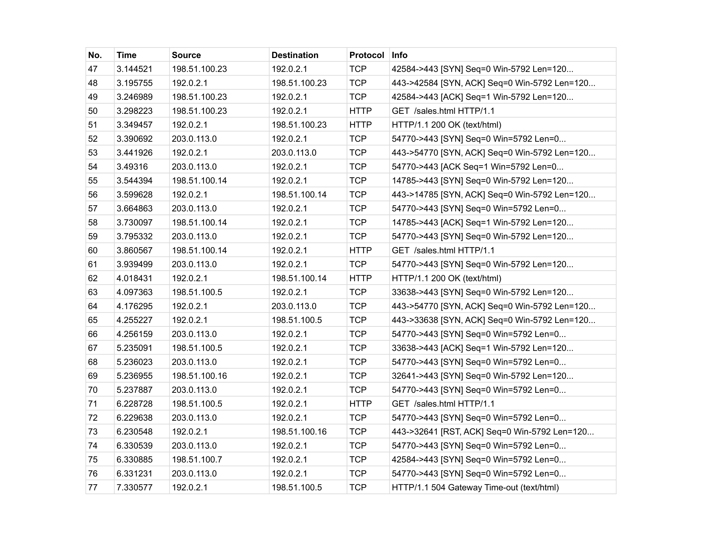
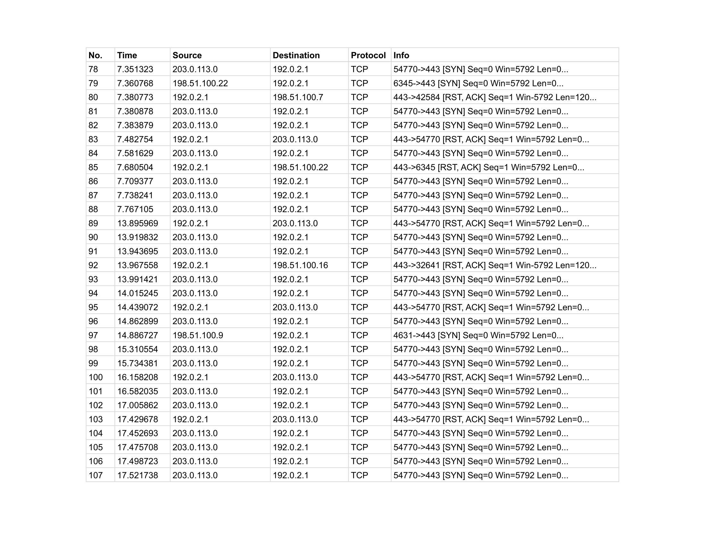
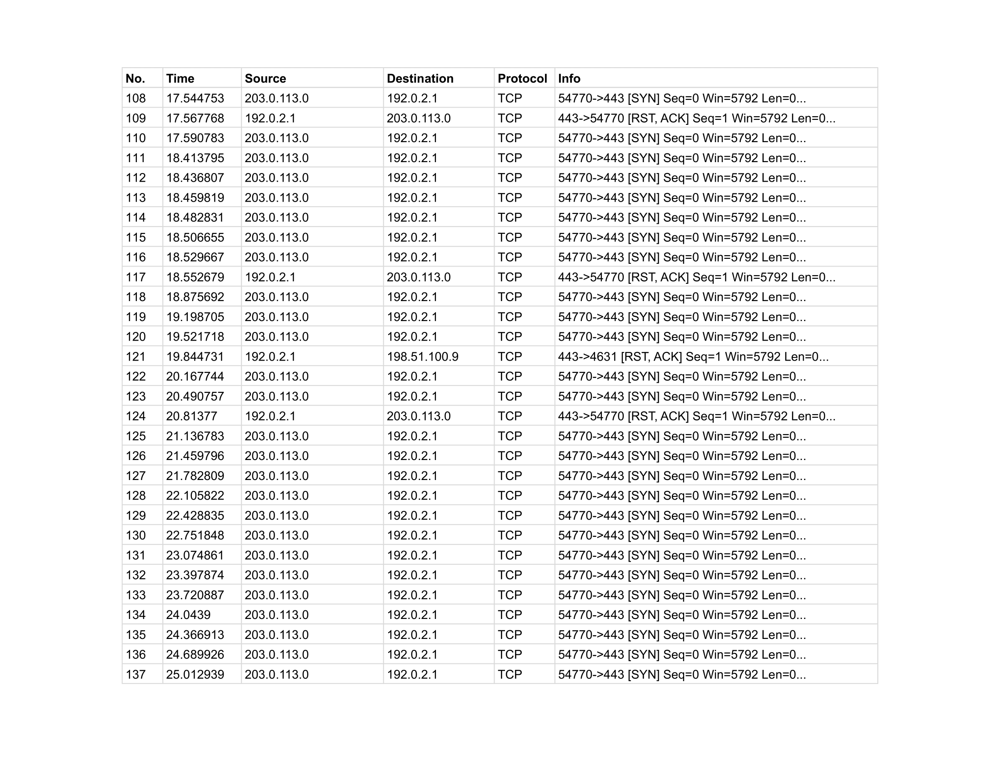
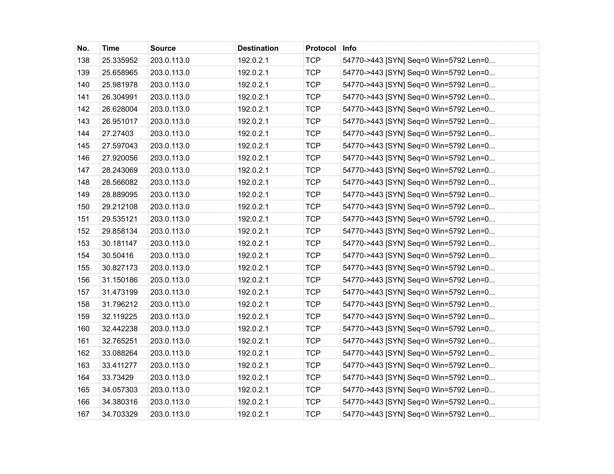
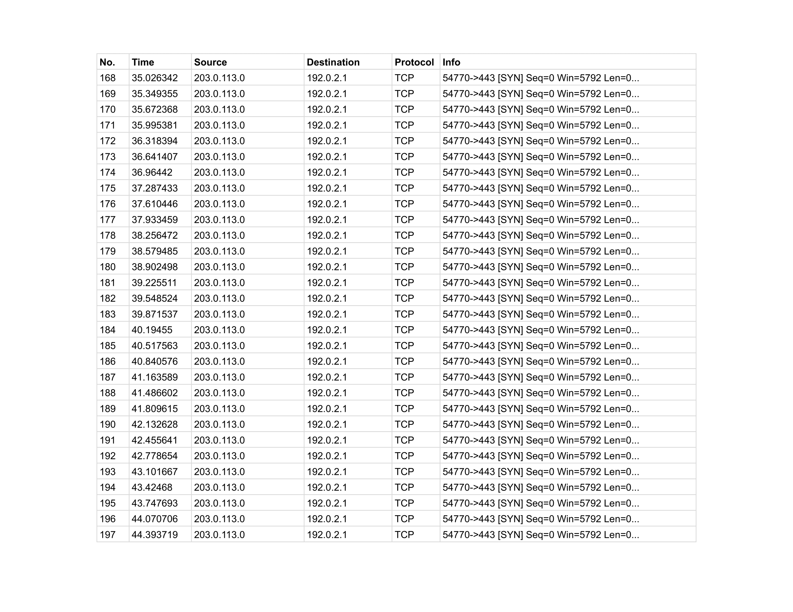
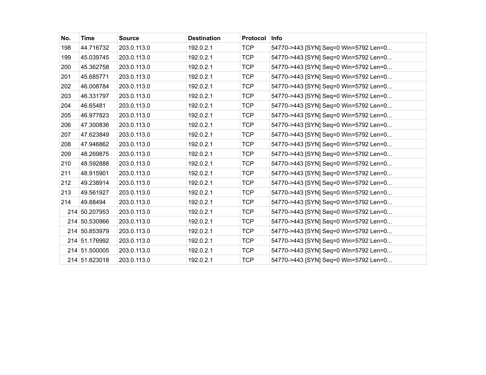
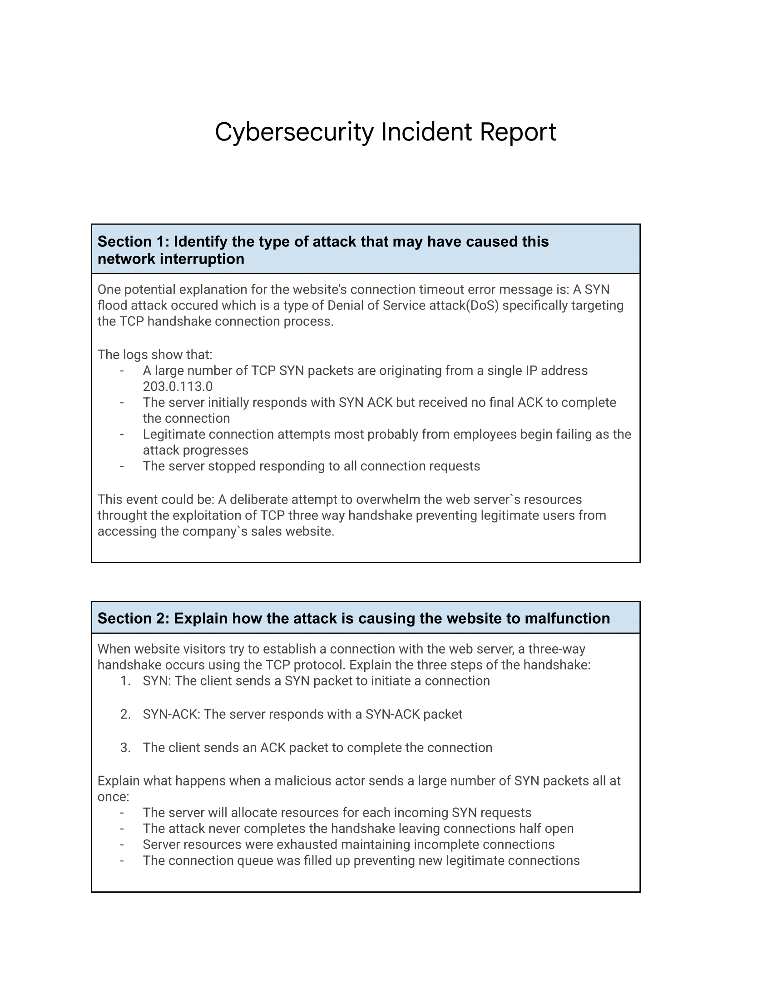
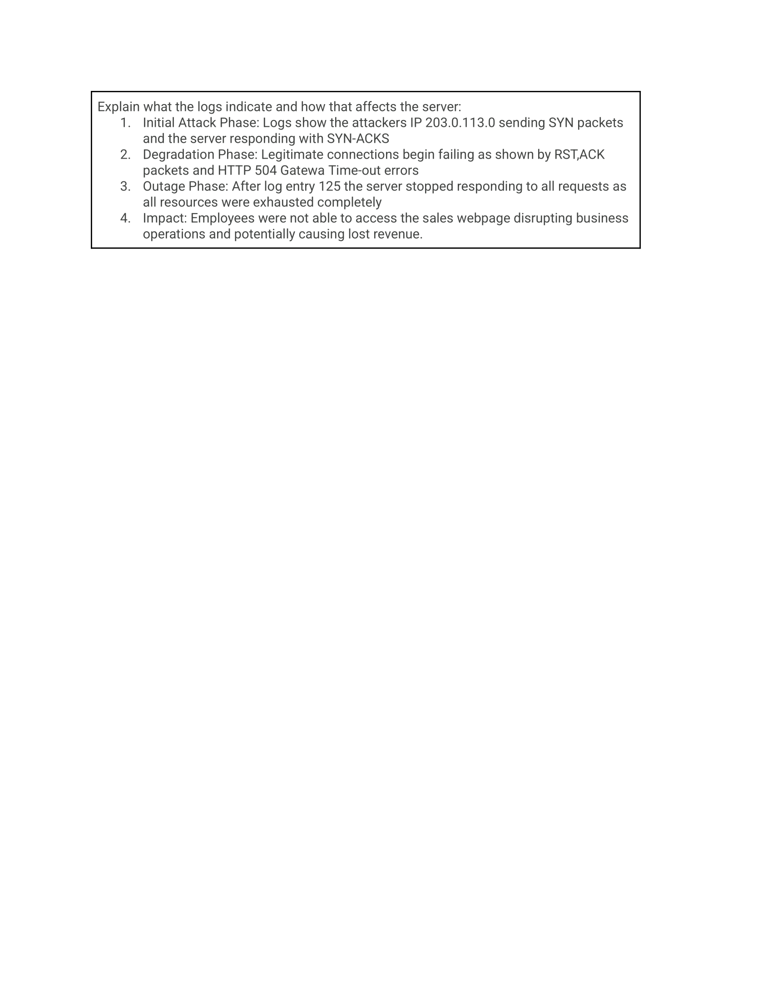

# Cybersecurity-incident-report
In this activity I will investigate a security issue reported by a customer who experienced service interruptions while accessing my company’s website. I will analyze the likely cause of the disruption, explain how the attack occurred, and assess its negative impact on website operations

## Scenario

## 

Review the following scenario. Then complete the step-by-step instructions.

You work as a security analyst for a travel agency that advertises sales and promotions on the company’s website. The employees of the company regularly access the company’s sales webpage to search for vacation packages their customers might like. 

One afternoon, you receive an automated alert from your monitoring system indicating a problem with the web server. You attempt to visit the company’s website, but you receive a connection timeout error message in your browser.

You use a packet sniffer to capture data packets in transit to and from the web server. You notice a large number of TCP SYN requests coming from an unfamiliar IP address. The web server appears to be overwhelmed by the volume of incoming traffic and is losing its ability to respond to the abnormally large number of SYN requests. You suspect the server is under attack by a malicious actor.

You take the server offline temporarily so that the machine can recover and return to a normal operating status. You also configure the company’s firewall to block the IP address that was sending the abnormal number of SYN requests. You know that your IP blocking solution won’t last long, as an attacker can spoof other IP addresses to get around this block. You need to alert your manager about this problem quickly and discuss the next steps to stop this attacker and prevent this problem from happening again. You will need to be prepared to tell your boss about the type of attack you discovered and how it was affecting the web server and employees.

